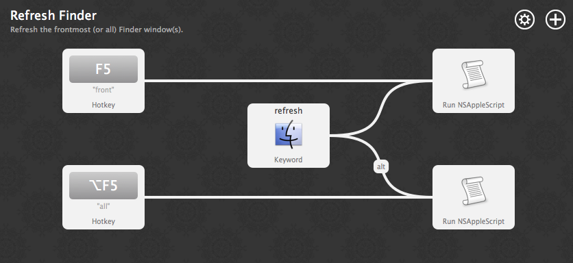
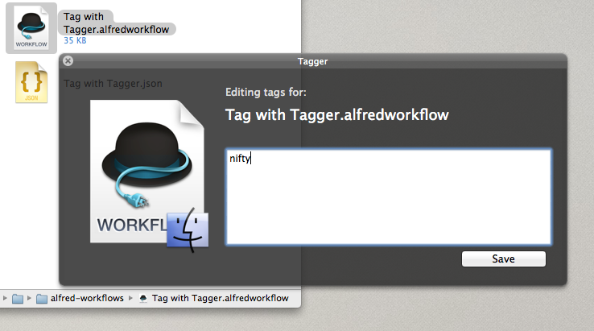
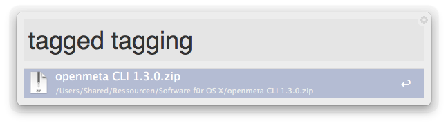
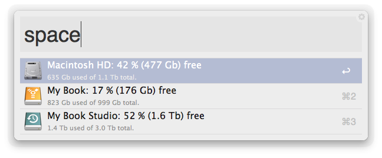
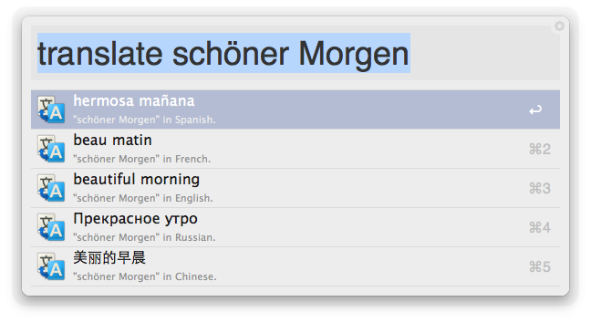
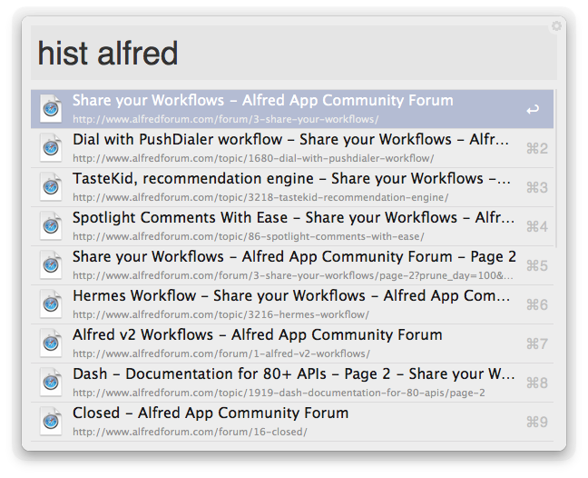

# Collected Alfred 2 workflows

Simple workflows for [Alfred version 2][alfred] that do not merit their own repository. Note you need the [Alfred Powerpack][alfred-powerpack] to enable workflows.

## Workflows included

### Refresh Finder

A straightforward port of Söderhavet’s [*Refresh Finder*][refresh-finder] utility to Alfred. Use a hotkey or the “refresh” keyword to force Finder to refresh the file listing in the frontmost window. Alternatively, all Finder windows can be refreshed (via another hotkey, or by holding down `alt` when actioning the keyword).

### Tag with Tagger

Ali Rantakari’s [*Tagger.app*][tagger] is a fantastic (and free) way to tag files according to the [OpenMeta standard][openmeta]. This workflow adds a hotkey to trigger it, and a file action for Alfred’s file browser (using the `tag` keyword).

### Tagg’d

A simple file filter companion to the tagging workflow above. Will search [OpenMeta][openmeta] tags, application specific tags (as long as they are stored as Spotlight keywords – `kmdItemKeywords` to the savvy) and Mavericks native tags.

### Disk space

An expanded version of [Florian Pellet’s disk space workflow][pellet-workflow-diskpace]. It has a friendlier display (including correct drive icons), handles volumes with spaces in their names, displays the correct name of the system drive and offers actions on the drives (Reveal in Finder by default, Browse in Alfred with the `fn` modifier).

### Google Translate

A version of [Florian Pellet’s Translation workflow][pellet-workflow-translate] that handles international characters correctly, both as input and output, treats multi-word queries as phrases instead of as separate queries, and adds a Paste in foreground application action (with the `Cmd` modifier). It’s also more easily extensible to other languages as the logic is in a central script: adding another language is a simple matter of adding a script filter running

    ./translate '<language code>'  '<language name>' "{query}" 

in `bash` (double quotes and escape variables need to be escaped).

### Now and Then (the web) 

A simple file filter to search all bookmark (keyword `web`) and web browsing history (keyword `hist`) files accessible to Spotlight. Currently searches the files generated by Safari and [Pinboard.in][pinboard] / [Delicious][delicious] accounts registered with [*Delish*][delish] and [*Webbla*][webbla]. If you’d like it to support other formats, please attach an example of a pertinent bookmark and / or web history file to [this issue](../../issues/1). Notes:

* History search searches the URL, bookmark search ignores it.
* Delicious and Pinboard tags are searched if, and only if, the underlying bookmarking schemes maps them to a known, Spotlight retrievable tagging scheme. Currently, this is only true when using [Webbla][webbla], which maps service tags to [OpenMeta][openmeta] tags.
* JavaScript bookmarklets are excluded from bookmarks searches.

## Installing and updating

To install, download the `.alfredworkflow` files from the repo. Updates to new versions can be automated via [Alleyoop][alleyoop]: [install Alleyoop][alleyoop-download] and do `oop`.

## Bugs and support

Please use [the repository’s issues section][issues] to check for known bugs or report new ones.

## License

All workflows licensed under the [WTFPL][wtfpl]. See [LICENSE](./LICENSE) for the full license text.

[alfred]: http://www.alfredapp.com
[alfred-powerpack]: http://www.alfredapp.com/powerpack/
[alleyoop]: http://alfred.daniel.sh
[alleyoop-download]:http://alfred.daniel.sh/Workflows/Alleyoop.alfredworkflow
[delicious]: http://www.delicious.com/
[delish]: http://pinepointsoftware.com/delish/
[issues]: ../../issues
[openmeta]: http://code.google.com/p/openmeta/
[pellet-workflow-diskpace]: http://www.alfredforum.com/topic/678-check-available-disk-space/?hl=%2Bdisk+%2Bspace 
[pellet-workflow-translate]: http://www.alfredforum.com/topic/120-google-translate-workflow/
[pinboard]: http://pinboard.in/
[refresh-finder]: http://soderhavet.com/refresh/refresh-finder/
[tagger]: http://hasseg.org/tagger/
[webbla]: http://www.celmaro.com/webbla/
[wtfpl]: http://www.wtfpl.net/
